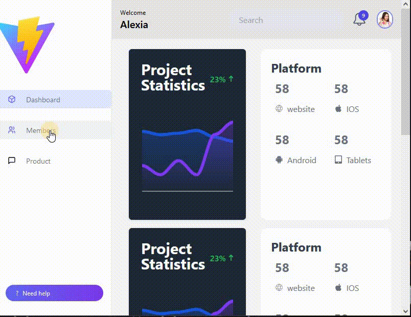

# React - Dashboard

# 🔗 [Live Preview](https://classy-klepon-4630ee.netlify.app/)

---

## About Project 👋

Just a simple Dashboard type of project taht displayes some cards of information. Here, i focus on react router and practicing component structure. It is not meant to be perfect or finished.

Created using Vite

---

## Features 👨‍💻

- **Navigation:** Allow users to navigate to different pages that show different content using react router

---

## How it works ⚙️

The main premise of the project is that we have some components that are always on the screen, such as Sidebar.jsx and Header.jsx. Using the nav links in the Sidebar, the user can go to different pages but what will actually happen is only the content in the main window will change, Sidebar and Header will always be on the screen. The component taht stores these "always present structure" is Layout.jsx. The rest of the app is jsut dummy content components

---

## Technologies & Dependencies used 📦

- **React:** components, functions etc..

- **React routes:** routes, index route

- **Flowbite:** for various charts, link: flowbite.com/docs/plugins/charts/

dependencies:

- "react": "^18.3.1",
- "react-dom": "^18.3.1",
- "react-icons": "^5.3.0",
- "react-router-dom": "^6.26.1"

devDependencies:

- "@eslint/js": "^9.9.0",
- "@types/react": "^18.3.3",
- "@types/react-dom": "^18.3.0",
- "@vitejs/plugin-react": "^4.3.1",
- "autoprefixer": "^10.4.20",
- "eslint": "^9.9.0",
- "eslint-plugin-react": "^7.35.0",
- "eslint-plugin-react-hooks": "^5.1.0-rc.0",
- "eslint-plugin-react-refresh": "^0.4.9",
- "globals": "^15.9.0",
- "postcss": "^8.4.45",
- "tailwindcss": "^3.4.10",
- "vite": "^5.4.3"

---

## Prerequisites 📚

Ensure you have the following installed on your system:

    Node.js v18.00.0
    npm or yarn

---

## Clone & Run locally 🏃‍♂️

1. **Clone the Repository:**

   - On the GitHub repo page, click the green "Code" button.

   - Copy the HTTPS URL.

2. **Open the Terminal:**

   - Open the terminal by typing "cmd" in your desktop's start menu, **OR**

   - Right-click on the desktop and select "Git Bash Here" (if you have Git Bash installed), **OR**

   - Open Visual Studio Code's terminal by clicking "Terminal" -> "New Terminal" inside the editor.

3. **Navigate to Your Project Location:**

   - In the terminal, navigate to your desired location (e.g., desktop) using the command: `cd desktop`. Adjust the path if your project is located elsewhere.

   - Ensure that your terminal's address is inside the project folder.

4. **Clone the Repository:**

   - Run the command: `git clone /link/`. Replace `/link/` with the HTTPS URL from step 1.

5. **Enter the Project Directory:**

   - Navigate into the cloned repository by typing: `cd /folder-name/`. Replace `/folder-name/` with the name of the cloned folder.

6. **Install Dependencies:**

   - Run the command: `npm install` to install all the necessary dependencies.

7. **Start the Project:**

   - Run the command: `npm run dev` or `yarn dev` to start the project. It will open in your default browser at [localhost:5173/](http://localhost:5173/)

---

## Project Structure 📂

    project-name/
    ├── public
    ├── src
    │ ├── components
    │ │ ├── all components
    │ ├── pages
    │ │ ├── all pages components
    │ ├── assets
    │ │ ├── some images
    │ ├── index.css
    │ ├── main.jsx
    │ └── App.jsx
    ├── index.html
    ├── package.json
    └── various config files

---

## Contributing 💻

Contributions are closed at the moment!
